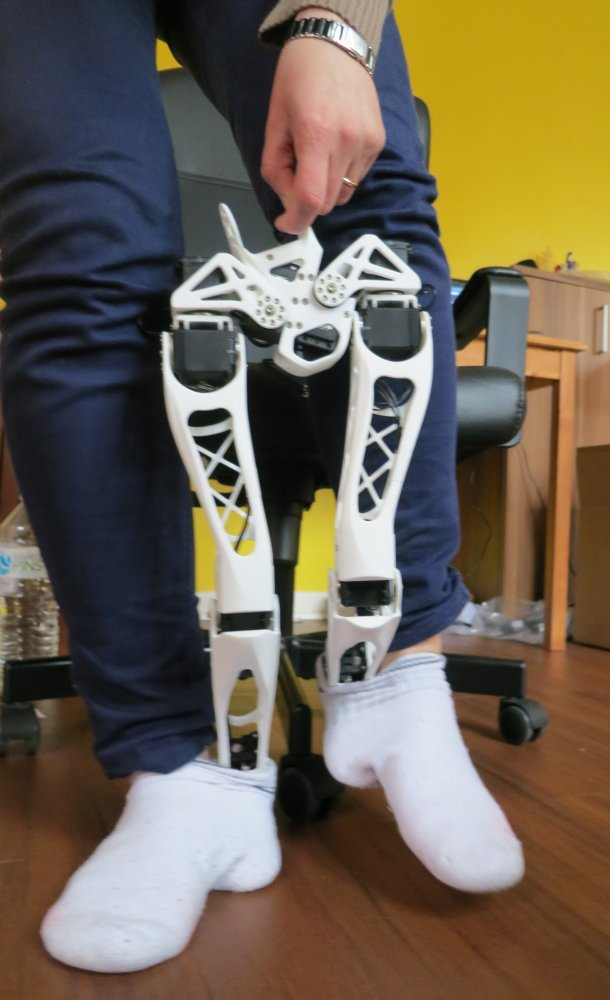

# walk/nearest-neighbor
This walk is not balanced, hold your robot!

This code was tested with only the legs and pelvis. It should adapt to a whole Poppy Humanoid. You may wish to change the distance computed in walk-nearest-neighboor.py at line 38.

Use the moveRecorder to record your Poppy Humanoid robot while you apply a walking movement to its body (using some smart trick ;) ).
  

Then use the neirest-neighbor to reconstruct a walk movemet where Poppy uses as next position the position in the rcorded sequence closest to its recent past positions.

